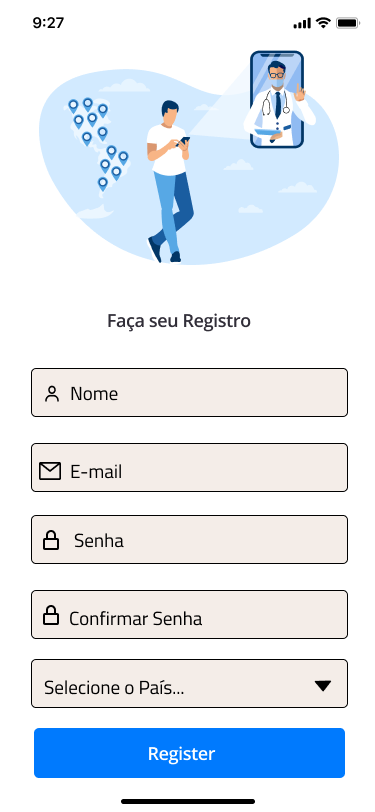
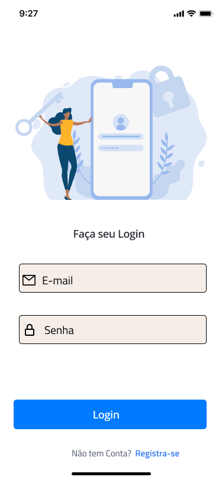
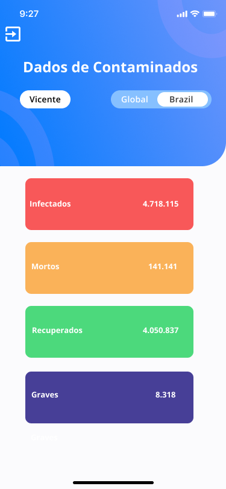

<p align="left">
   
</p>

# Dados Covid

> View your covid data in the Covid Data app

[](https://github.com/VicenteEfenequis)
[](#)
[](https://github.com/VicenteEfenequis/w2bit-mobile/stargazers)
[](https://github.com/Vicenteefenequis/w2bit-mobile/network/members)
[](https://github.com/VicenteEfenequis/w2bit-mobile/graphs/contributors)

---

# :pushpin: Table of Contents

- [Dados Covid](#dados-covid)
- [:pushpin: Table of Contents](#pushpin-table-of-contents)
- [:rocket: Features](#rocket-features)
- [:construction_worker: Installation](#construction_worker-installation)
- [:runner: Getting Started](#runner-getting-started)
- [:postbox: Faq](#postbox-faq)
- [:bug: Issues](#bug-issues)
- [:closed_book: License](#closed_book-license)

<br />
<span align="center"></span>
<span align="center"></span>
<span align="center"></span>

<span align="center"></span>


# :rocket: Features

* Create accounts in the app.
* Login in the app.
* List covid account data


# :construction_worker: Installation

**You need to install [Node.js](https://nodejs.org/en/download/) and [Npm](https://www.npmjs.com/) first, then in order to clone the project via HTTPS, run this command:**

```git clone https://github.com/Vicenteefenequis/w2bit-mobile.git```

SSH URLs provide access to a Git repository via SSH, a secure protocol. If you have a SSH key registered in your Github account, clone the project using this command:

```git clone git@github.com:Vicenteefenequis/w2bit-mobile.git```

**Install dependencies**

```npm install```

Create your enviroment variables based on the examples of ```databaseKeyAcess.example.json and rapidApiKeyAcess.example.json```

```cp databaseKeyAcess.example.json  databaseKeyAcess.json ```

```cp rapidApiKeyAcess.example.json  rapidApiKeyAcess.json ```

After copying the examples, make sure to fill the variables with new values.

**Setup the API**

The interface needs to interact with the server to receive and register data.

Make sure to go to the [Rapid API](https://rapidapi.com/Gramzivi/api/covid-19-data) repository and follow the instructions in order to get it running in your machine.

# :runner: Getting Started

Run the following command in order to start the application in a development environment:

```expo start```


# :postbox: Faq

**Question:** What are the tecnologies used in this project?

**Answer:** The tecnologies used in this project are [React Native](https://reactnative.dev/) + [Styled Components](https://styled-components.com/) to handle scoped CSS and 


I'm also using [Axios](https://github.com/axios/axios) in order to easily cache and mutate the transactions data.

# :bug: Issues

Feel free to **file a new issue** with a respective title and description on the [W2 Bit Mobile](https://github.com/Vicenteefenequis/w2bit-mobile/issues) repository. If you already found a solution to your problem, **i would love to review your pull request**! 


# :closed_book: License

Released in 2020 (Work in progress)
This project is under the [MIT license](https://github.com/VicenteEfenequis/w2bit-mobile/master/LICENSE).

Made with love by [Vicente Nascimento](https://github.com/VicenteEfenequis) 💜🚀
